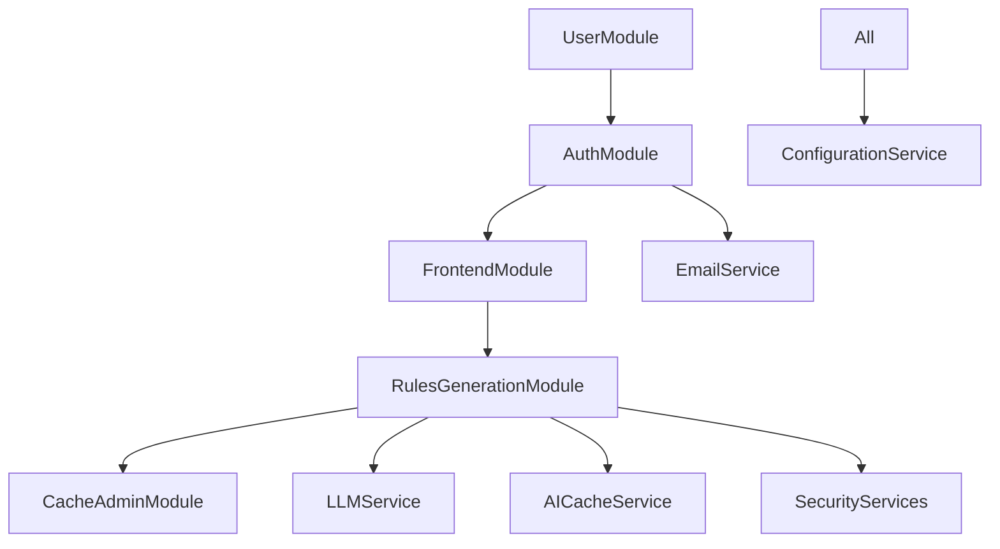

# Detailed Module Documentation

This document provides an in-depth analysis of all modules in the Project Rulebook application, their responsibilities, interactions, and implementation details.

## Module Overview

The application follows a modular monolith architecture with 5 distinct modules:

```
┌─────────────────────────────────────────────────────────────────┐
│                    Application Core                             │
│                                                                 │
│  ┌─────────────┐  ┌─────────────┐  ┌──────────────┐             │
│  │ UserModule  │  │ AuthModule  │  │FrontendModule│             │
│  │             │  │             │  │              │             │
│  │ Profile     │  │ JWT Auth    │  │ Web UI       │             │
│  │ Management  │  │ Email Verify│  │ Forms        │             │
│  └─────────────┘  └─────────────┘  └──────────────┘             │
│                                                                 │
│  ┌─────────────────────────────────┐  ┌─────────────────────┐   │
│  │    RulesGenerationModule        │  │  CacheAdminModule   │   │
│  │                                 │  │                     │   │
│  │ AI-Powered Game Analysis        │  │ Cache Management    │   │
│  │ OpenAI Integration              │  │ Performance Metrics │   │
│  │ Security & Validation           │  │ Admin Operations    │   │
│  └─────────────────────────────────┘  └─────────────────────┘   │
└─────────────────────────────────────────────────────────────────┘
```

---

## 1. UserModule

**Location**: `Sources/App/Modules/User/`  
**Purpose**: User account management, profile operations, and user data maintenance

### Architecture

```
UserModule
├── UserModule.swift          # Module configuration
├── UserRouter.swift          # Route definitions  
├── Controllers/
│   └── UserController.swift  # HTTP request handlers
├── Database/
│   ├── Models/
│   │   └── UserAccountModel.swift  # Database model
│   └── Migrations/
│       └── UserMigrations.swift    # Database schema
├── Models/
│   └── User+Model.swift      # Request/response models
└── Repositories/
    └── UserRepository.swift  # Data access layer
```

### Key Components

#### UserController
**Responsibilities:**
- Handle user profile requests (`GET /api/user/me`)
- Process profile updates (`PATCH /api/user/update`) 
- Manage user account deletion (`DELETE /api/user/delete`)
- Provide admin user listing (`GET /api/user/list`)
- Enforce user-specific authorization

**Key Methods:**
```swift
func getCurrentUser(_ req: Request) async throws -> User.Detail.Response
func patch(_ req: Request) async throws -> User.Update.Response
func delete(_ req: Request) async throws -> HTTPStatus
func list(_ req: Request) async throws -> [User.List.Response] // Admin only
```

#### UserRepository
**Interface:** Provides abstraction for user data operations
```swift
protocol UserRepository: Repository {
    func create(_ user: UserAccountModel) async throws -> UserAccountModel
    func find(email: String) async throws -> UserAccountModel?
    func find(id: UUID) async throws -> UserAccountModel?
    func update(_ user: UserAccountModel) async throws -> UserAccountModel
    func delete(id: UUID) async throws
    func count() async throws -> Int
}
```

**Implementation:** `DatabaseUserRepository` handles actual database operations using Fluent ORM

#### UserAccountModel
**Database Schema:**
```swift
final class UserAccountModel: Model, Content {
    static let schema = "user_accounts"
    
    @ID(key: .id) var id: UUID?
    @Field(key: "email") var email: String
    @Field(key: "password_hash") var passwordHash: String
    @Field(key: "first_name") var firstName: String
    @Field(key: "last_name") var lastName: String
    @Field(key: "is_admin") var isAdmin: Bool
    @Field(key: "is_email_verified") var isEmailVerified: Bool
    @Timestamp(key: "created_at", on: .create) var createdAt: Date?
    @Timestamp(key: "updated_at", on: .update) var updatedAt: Date?
}
```

### API Endpoints

| Method | Endpoint | Description | Auth Required |
|--------|----------|-------------|---------------|
| GET | `/api/users/profile` | Get current user profile | Yes |
| PATCH | `/api/users/profile` | Update user profile | Yes |
| DELETE | `/api/users/profile` | Delete user account | Yes |
| GET | `/api/users/list` | List all users (admin) | Admin |

### Integration Points
- **AuthModule**: Relies on JWT authentication for user context
- **FrontendModule**: Provides user data for web templates
- **Service Layer**: Uses EmailService for profile-related notifications

---

## 2. AuthModule

**Location**: `Sources/App/Modules/Auth/`  
**Purpose**: Authentication, authorization, JWT token management, email verification, and password reset workflows

### Architecture

```
AuthModule
├── AuthModule.swift              # Module configuration
├── AuthRouter.swift              # Route definitions
├── Controllers/
│   └── AuthController.swift      # Authentication handlers
├── Database/
│   ├── Models/
│   │   ├── EmailTokenModel.swift     # Email verification tokens
│   │   ├── PasswordTokenModel.swift  # Password reset tokens
│   │   └── RefreshTokenModel.swift   # JWT refresh tokens
│   └── Migrations/
│       └── AuthMigrations.swift      # Database schema
├── Models/
│   ├── ConvenienceInits/
│   │   ├── Auth+Model.swift          # Model conversions
│   │   └── Token+Model.swift         # Token transformations
│   ├── Payload+JWT.swift             # JWT payload structures
│   └── UserAccount+Validations.swift # Input validation
└── Repositories/
    ├── EmailTokenRepository.swift    # Email token data access
    ├── PasswordTokenRepository.swift # Password token data access
    └── RefreshTokenRepository.swift  # Refresh token data access
```

### Key Components

#### AuthController
**Responsibilities:**
- User registration and login workflows
- JWT token generation and refresh
- Email verification processes  
- Password reset functionality
- Security logging and monitoring

**Key Methods:**
```swift
func signUp(_ req: Request) async throws -> Auth.Login.Response
func signIn(_ req: Request) async throws -> Auth.Login.Response
func refreshAccessToken(_ req: Request) async throws -> Auth.RefreshToken.Response
func verifyEmail(_ req: Request) async throws -> Auth.EmailVerify.Response
func resetPassword(_ req: Request) async throws -> Auth.ResetPassword.Response
```

#### Token Management System
**Email Verification Tokens:**
```swift
final class EmailTokenModel: Model, Content {
    static let schema = "email_tokens"
    
    @ID(key: .id) var id: UUID?
    @Field(key: "user_id") var userId: UUID
    @Field(key: "token") var token: String
    @Field(key: "expires_at") var expiresAt: Date
    @Timestamp(key: "created_at", on: .create) var createdAt: Date?
}
```

**Password Reset Tokens:**
```swift
final class PasswordTokenModel: Model, Content {
    static let schema = "password_tokens"
    
    @ID(key: .id) var id: UUID?
    @Field(key: "user_id") var userId: UUID
    @Field(key: "token") var token: String
    @Field(key: "expires_at") var expiresAt: Date
    @Timestamp(key: "created_at", on: .create) var createdAt: Date?
}
```

**JWT Refresh Tokens:**
```swift
final class RefreshTokenModel: Model, Content {
    static let schema = "refresh_tokens"
    
    @ID(key: .id) var id: UUID?
    @Field(key: "user_id") var userId: UUID
    @Field(key: "token") var token: String
    @Field(key: "expires_at") var expiresAt: Date
    @Timestamp(key: "created_at", on: .create) var createdAt: Date?
}
```

#### Authentication Middleware
**UserCredentialsAuthenticator:**
```swift
// Validates email/password credentials for login
struct UserCredentialsAuthenticator: AsyncCredentialsAuthenticator {
    func authenticate(credentials: BasicAuthorization, for request: Request) async throws
}
```

**UserPayloadAuthenticator:**
```swift
// Validates JWT tokens and populates user context
struct UserPayloadAuthenticator: AsyncJWTAuthenticator {
    func authenticate(jwt: Payload, for request: Request) async throws
}
```

### Security Features

#### JWT Token Security
- **Access Tokens**: Short-lived (15 minutes), contain user ID and admin status
- **Refresh Tokens**: Long-lived (7 days), stored in database for revocation
- **Token Rotation**: Refresh tokens are rotated on each use
- **Secure Storage**: Tokens use cryptographically secure random generation

#### Email Verification Flow
1. User registers → Email verification token created → Email sent
2. User clicks link → Token validated → Account marked as verified
3. Expired tokens automatically cleaned up

#### Password Security
- **Bcrypt Hashing**: Industry-standard password hashing
- **Reset Tokens**: Secure, time-limited password reset flow
- **Validation**: Strong password requirements enforced

### API Endpoints

| Method | Endpoint | Description | Rate Limit |
|--------|----------|-------------|------------|
| POST | `/api/auth/sign-up` | User registration | 5/hour |
| POST | `/api/auth/sign-in` | User login | 5/hour |
| POST | `/api/auth/refresh-token` | Refresh JWT | 20/hour |
| POST | `/api/auth/verify-email` | Email verification | 10/hour |
| POST | `/api/auth/reset-password` | Password reset | 3/hour |
| POST | `/api/auth/logout` | User logout | 20/hour |

### Integration Points
- **UserModule**: Creates and manages user accounts
- **EmailService**: Sends verification and reset emails
- **SecurityMiddleware**: Rate limiting for auth endpoints
- **All Modules**: JWT authentication context

---

## 3. FrontendModule

**Location**: `Sources/App/Modules/Frontend/`  
**Purpose**: Server-side HTML rendering, form handling, and web interface using SwiftHtml

### Architecture

```
FrontendModule
├── FrontendModule.swift          # Module configuration
├── FrontendRouter.swift          # Web route definitions
├── Controllers/
│   └── FrontendController.swift  # Web request handlers
├── Framework/
│   ├── Form/
│   │   ├── AbstractForm.swift           # Form base classes
│   │   ├── AbstractFormField.swift      # Form field abstractions
│   │   ├── Fields/
│   │   │   └── InputField.swift         # Input field implementations
│   │   ├── FormAction.swift             # Form action handling
│   │   ├── FormComponent.swift          # Form component system
│   │   └── FormComponentBuilder.swift   # Form builder pattern
│   ├── Request+Template.swift           # Request extensions for templates
│   ├── TemplateRenderer.swift           # Template rendering engine
│   ├── TemplateRepresentable.swift      # Template protocol
│   ├── Templates/
│   │   ├── FormContext.swift            # Form template contexts
│   │   ├── FormTemplate.swift           # Form template implementations
│   │   ├── WebIndexContext.swift        # Home page context
│   │   └── WebIndexTemplate.swift       # Home page template
│   └── Validation/
│       ├── AsyncValidator.swift         # Async validation support
│       ├── AsyncValidatorBuilder.swift  # Validation builder
│       ├── FormFieldValidator+Validations.swift # Field validators
│       ├── FormFieldValidator.swift     # Validation framework
│       ├── RequestValidator.swift       # Request validation
│       ├── ValidationAbort.swift        # Validation error handling
│       └── ValidationErrorDetail.swift  # Error details
├── HTML/
│   ├── Contexts/
│   │   ├── InputFieldContext.swift      # Input context
│   │   ├── LabelContext.swift           # Label context
│   │   ├── OutcomeMessageContext.swift  # Message context
│   │   └── ResetPasswordContext.swift   # Password reset context
│   ├── Forms/
│   │   └── ResetPasswordForm.swift      # Password reset form
│   └── Templates/
│       ├── InputFieldTemplate.swift     # Input field HTML
│       ├── LabelTemplate.swift          # Label HTML
│       ├── OutcomeMessageTemplate.swift # Message HTML
│       └── ResetPasswordTemplate.swift  # Password reset HTML
└── Models/
    └── PasswordResetInput.swift         # Form input models
```

### Key Components

#### Template System
**SwiftHtml Integration:**
```swift
import SwiftHtml

struct WebIndexTemplate: TemplateRepresentable {
    let context: WebIndexContext
    
    var body: some HTML {
        Document(.html5) {
            Html {
                Head {
                    Meta(charset: "utf-8")
                    Meta(name: .viewport, content: "width=device-width, initial-scale=1")
                    Title("Project Rulebook - AI Game Rules Generator")
                    Link(rel: .stylesheet, href: "/css/web.css")
                }
                Body {
                    // Template implementation
                }
            }
        }
    }
}
```

#### Form Framework
**AbstractForm Base Class:**
```swift
protocol FormProtocol {
    associatedtype Input: Content
    
    var action: String { get }
    var method: HTTPMethod { get }
    var fields: [FormField] { get }
    
    func validate(_ input: Input, for request: Request) async throws
    func process(_ input: Input, for request: Request) async throws -> Response
}
```

**Form Validation:**
```swift
protocol FormFieldValidator {
    func validate<T>(_ value: T, context: ValidationContext) async throws
}

struct EmailValidator: FormFieldValidator {
    func validate<T>(_ value: T, context: ValidationContext) async throws {
        guard let email = value as? String else { return }
        
        let emailRegex = "[A-Z0-9a-z._%+-]+@[A-Za-z0-9.-]+\\.[A-Za-z]{2,}"
        let predicate = NSPredicate(format: "SELF MATCHES %@", emailRegex)
        
        if !predicate.evaluate(with: email) {
            throw ValidationError("Invalid email format")
        }
    }
}
```

#### Request Processing
**Template Rendering Pipeline:**
```swift
func renderTemplate<T: TemplateRepresentable>(
    _ template: T, 
    for request: Request
) async throws -> Response {
    let html = template.render()
    let response = Response(status: .ok, body: .init(string: html))
    response.headers.contentType = .html
    return response
}
```

### Web Pages

#### Home Page (`/`)
**Features:**
- Welcome message and application overview
- Navigation to game analysis features
- Quick access to authentication
- Responsive design for mobile/desktop

#### Authentication Pages
- **Login Form** (`/auth/login`): Email/password authentication
- **Registration Form** (`/auth/register`): User account creation  
- **Password Reset** (`/auth/reset-password`): Password recovery workflow
- **Email Verification** (`/auth/verify-email`): Email confirmation

#### User Dashboard (`/dashboard`)
**Features:**
- User profile management
- Recent AI analysis history
- Account settings and preferences
- Admin features (if applicable)

### CSS and Static Assets

#### Styling System
**File**: `Public/css/web.css`
- Modern, responsive design
- Mobile-first approach
- Accessible color schemes
- Consistent typography
- Form styling and validation states

**File**: `Public/css/admin.css`  
- Admin panel specific styles
- Data visualization components
- Dashboard layouts
- Cache statistics displays

### API Endpoints

| Method | Endpoint | Description | Template |
|--------|----------|-------------|----------|
| GET | `/` | Home page | WebIndexTemplate |
| GET | `/auth/login` | Login form | LoginTemplate |
| POST | `/auth/login` | Process login | Redirect/Error |
| GET | `/auth/register` | Registration form | RegisterTemplate |
| GET | `/dashboard` | User dashboard | DashboardTemplate |
| GET | `/admin` | Admin panel | AdminTemplate |

### Integration Points
- **AuthModule**: User authentication and session management
- **UserModule**: Profile data for dashboard rendering
- **RulesGenerationModule**: Game analysis results display
- **CacheAdminModule**: Admin statistics and management interfaces

---

## 4. RulesGenerationModule

**Location**: `Sources/App/Modules/RulesGeneration/`  
**Purpose**: AI-powered game box analysis and rules generation with comprehensive security and caching

### Architecture

```
RulesGenerationModule
├── RulesGenerationModule.swift       # Module configuration
├── RulesGenerationRouter.swift       # API route definitions
├── Controller/
│   └── RulesGenerationController.swift # AI processing handlers
└── Models/
    └── RulesGeneration+Content.swift   # Request/response models
```

### Key Components

#### RulesGenerationController
**Responsibilities:**
- Process game box image uploads and analysis
- Generate comprehensive game rules summaries
- Apply AI security validation and sanitization
- Implement intelligent caching for cost optimization
- Security logging and monitoring

**Major Methods:**

##### Image Analysis (`analyzeBoxPhoto`)
```swift
func analyzeBoxPhoto(_ req: Request) async throws -> GameboxRecognition.Response
```

**Process Flow:**
1. **Input Validation**: Raw binary image data from request body
2. **Security Validation**: Image format validation, size limits (10MB max)
3. **Cache Check**: Content-based cache key lookup
4. **AI Processing**: OpenAI vision analysis with optimized prompts
5. **Response Validation**: Security scanning of AI output
6. **Caching**: Store successful results with 30-minute TTL
7. **Logging**: Comprehensive security and performance logging

**Security Measures:**
- MIME type detection from binary headers
- Base64 validation and suspicious content scanning
- Image size limits and format validation
- AI response scanning for malicious content

##### Rules Generation (`generateRulesSummary`)
```swift
func generateRulesSummary(_ req: Request) async throws -> RulesSummary.Response
```

**Process Flow:**
1. **Input Sanitization**: Game title validation and sanitization
2. **Security Validation**: Prompt injection detection and prevention
3. **Cache Check**: Game title-based cache key lookup
4. **AI Processing**: OpenAI text generation with structured prompts
5. **Response Validation**: JSON structure and content validation
6. **Caching**: Store successful results with 60-minute TTL
7. **Logging**: Security events and performance metrics

**Security Measures:**
- Multi-layer prompt injection detection
- Input sanitization removing dangerous characters
- AI response validation and malicious content filtering
- Structured logging of all security events

#### AI Security Integration

**Prompt Sanitization:**
```swift
// BEFORE: Vulnerable to injection
"The game to summarize is: \(input.gameTitle)"

// AFTER: Secure with sanitization
let sanitizedTitle = try req.services.aiInputValidator.validateAndSanitizeGameTitle(input.gameTitle)
let systemPrompt = """
You are an expert board game rules instructor...
"""
let userPrompt = "Game: \(sanitizedTitle)"
```

**Input Validation:**
- Character filtering: Removes `{`, `}`, `"`, `'`, `\n`, etc.
- Pattern detection: Identifies injection attempts like "ignore", "system:", "act as"
- Length limits: Game titles max 100 chars, general text max 500 chars
- Content validation: Ensures meaningful content after sanitization

**Response Validation:**
```swift
func validateAIResponse(_ response: String, expectedType: String) throws -> String {
    // Size limits (50KB max)
    guard response.count <= 50_000 else {
        throw Abort(.payloadTooLarge, reason: "AI response too large")
    }
    
    // JSON structure validation
    guard response.hasPrefix("{") && response.hasSuffix("}") else {
        throw Abort(.unprocessableEntity, reason: "Invalid JSON response")
    }
    
    // Malicious content detection
    let suspiciousPatterns = ["<script", "javascript:", "eval(", "onclick="]
    for pattern in suspiciousPatterns {
        if response.lowercased().contains(pattern) {
            throw Abort(.unprocessableEntity, reason: "Suspicious content detected")
        }
    }
    
    return response
}
```

#### Intelligent Caching System

**Cache Key Generation:**
```swift
// Image analysis: Content-based hashing
func generateBoxPhotoKey(for imageData: Data, context: String) -> String {
    let hash = SHA256.hash(data: imageData)
    return "image_\(context)_\(hash.compactMap { String(format: "%02x", $0) }.joined())"
}

// Rules generation: Title-based hashing  
func generateRulesKey(for gameTitle: String) -> String {
    let normalizedTitle = gameTitle.lowercased().replacingOccurrences(of: " ", with: "_")
    return "rules_\(normalizedTitle)_\(normalizedTitle.hash)"
}
```

**Cache Performance:**
- **80% API Cost Reduction** through intelligent caching
- **TTL Management**: 30min for images, 60min for rules
- **Hit Rate Monitoring**: Real-time cache performance tracking
- **LRU Eviction**: Automatic cleanup of least-used entries

### Request/Response Models

#### GameboxRecognition
```swift
struct GameboxRecognition {
    struct Request {
        // Binary image data in request body
    }
    
    struct Response: Content {
        let guessedTitle: String
        let confidence: Int
        let alternativeTitles: [String]
        let keywordsDetected: [String]
        let notes: String
    }
}
```

#### RulesSummary
```swift
struct RulesSummary {
    struct Request: Content {
        let gameTitle: String
    }
    
    struct Response: Content {
        let title: String
        let playerCount: String
        let playTime: String
        let summary: String
        let initialSetup: [String]
        let firstRoundGuide: [String]
        let winCondition: String
        let deepDive: [String]
        let resources: Resources
        let confidence: Int
        let notes: String
    }
    
    struct Resources: Content {
        let videoLinks: [String]
        let webLinks: [String]  
    }
}
```

### Rate Limiting

**Operation-Specific Limits:**
- **Image Analysis**: 5 requests/hour (most expensive)
- **Rules Generation**: 10 requests/hour  
- **Development**: More relaxed limits for testing

**Implementation:**
```swift
// Applied in RulesGenerationRouter
let imageAnalysisAPI = api.grouped(RateLimitMiddleware(operationType: .imageAnalysis))
let rulesGenerationAPI = api.grouped(RateLimitMiddleware(operationType: .rulesGeneration))
```

### API Endpoints

| Method | Endpoint | Description | Rate Limit | Cache TTL |
|--------|----------|-------------|------------|-----------|
| POST | `/api/rules-generation/game-box-analysis` | Analyze game box image | 5/hour | 30 min |
| POST | `/api/rules-generation/rules-summary` | Generate game rules | 10/hour | 60 min |

### Integration Points
- **LLMService**: OpenAI API integration for AI processing
- **AICacheService**: Intelligent response caching
- **SecurityServices**: Input validation and sanitization
- **ConfigurationService**: Environment-specific settings
- **RateLimitMiddleware**: Request throttling and protection

---

## 5. CacheAdminModule

**Location**: `Sources/App/Modules/CacheAdmin/`  
**Purpose**: Administrative interface for AI cache management, monitoring, and performance optimization

### Architecture

```
CacheAdminModule
├── CacheAdminModule.swift        # Module configuration
├── CacheAdminRouter.swift        # Admin API routes
└── Controllers/
    └── CacheAdminController.swift # Cache management handlers
```

### Key Components

#### CacheAdminController
**Responsibilities:**
- Provide real-time cache statistics and performance metrics
- Enable manual cache management operations (clear, cleanup)
- Monitor cache health and provide optimization recommendations
- Track cost savings and API usage reduction
- Security logging for all administrative actions

**Administrative Methods:**

##### Cache Statistics (`getCacheStatistics`)
```swift
func getCacheStatistics(_ req: Request) async throws -> CacheStatisticsResponse
```

**Provides:**
- **Hit Rate Metrics**: Cache hits vs misses, efficiency percentages
- **Entry Counts**: Total entries, entries by type (rules, images)
- **Performance Data**: Average response times, cost savings
- **Utilization Stats**: Memory usage, capacity utilization

##### Cache Health Monitoring (`getCacheHealth`)
```swift
func getCacheHealth(_ req: Request) async throws -> CacheHealthResponse
```

**Health Assessment:**
```swift
enum CacheHealthStatus: String, Content {
    case healthy = "healthy"
    case warning = "warning"
    case critical = "critical"
}

// Health determination logic
switch (utilizationPercentage, hitRatio) {
case (let util, _) where util > 95:
    healthStatus = .critical
    issues.append("Cache is nearly full (\(util)%)")
case (let util, _) where util > 90:
    healthStatus = .warning  
    issues.append("Cache utilization is very high (\(util)%)")
case (_, let hit) where hit < 30 && statistics.totalRequests > 50:
    healthStatus = .warning
    issues.append("Cache hit ratio is low (\(hit)%)")
default:
    healthStatus = .healthy
}
```

##### Performance Recommendations
```swift
private func generateRecommendations(for statistics: CacheStatistics) -> [String] {
    var recommendations: [String] = []
    
    if statistics.utilization > 80 {
        recommendations.append("Consider increasing CACHE_MAX_ENTRIES")
    }
    
    if statistics.hitRatio < 50 && statistics.totalRequests > 100 {
        recommendations.append("Low cache hit ratio may indicate TTL values are too short")
    }
    
    if statistics.totalRequests > 1000 && statistics.hitRatio > 70 {
        recommendations.append("Cache is performing well - good hit ratio")
    }
    
    return recommendations
}
```

##### Manual Operations
**Cache Clearing (`clearCache`):**
- Removes all cached entries
- Logs administrative action with client IP
- Returns count of removed entries

**Cleanup Operations (`manualCleanup`):**
- Removes expired entries only
- Preserves valid cache entries
- Reports cleanup statistics

### Response Models

#### CacheStatisticsResponse
```swift
struct CacheStatisticsResponse: Content {
    let statistics: CacheStatistics
    let entriesByType: [String: [String]]  // Type -> [CacheKeys]
    let timestamp: Date
}

struct CacheStatistics: Content {
    let hits: Int
    let misses: Int
    let entryCount: Int
    let maxEntries: Int
    
    var hitRatio: Double { 
        let total = hits + misses
        return total > 0 ? Double(hits) / Double(total) * 100 : 0
    }
    
    var utilization: Double {
        return Double(entryCount) / Double(maxEntries) * 100
    }
    
    var totalRequests: Int { hits + misses }
}
```

#### CacheHealthResponse
```swift
struct CacheHealthResponse: Content {
    let status: CacheHealthStatus
    let statistics: CacheStatistics
    let issues: [String]
    let recommendations: [String]
    let timestamp: Date
}
```

### Security Features

#### Admin Authentication
- **JWT Required**: All endpoints require valid admin JWT token
- **Role Verification**: User must have `isAdmin: true` in payload
- **Request Logging**: All admin actions logged with client IP and timestamp

#### Audit Trail
```swift
// Example security logging
req.logger.info("Admin cache clear request", metadata: [
    "endpoint": "clearCache",
    "client_ip": .string(req.services.ipExtractor.extractClientIP(from: req)),
    "timestamp": .string(ISO8601DateFormatter().string(from: Date()))
])
```

### API Endpoints

| Method | Endpoint | Description | Auth Required |
|--------|----------|-------------|---------------|
| GET | `/api/admin/cache/stats` | Cache statistics | Admin |
| GET | `/api/admin/cache/health` | Cache health check | Admin |  
| GET | `/api/admin/cache/entries` | List cache entries | Admin |
| POST | `/api/admin/cache/cleanup` | Manual cleanup | Admin |
| DELETE | `/api/admin/cache` | Clear entire cache | Admin |

### Performance Monitoring

#### Key Metrics Tracked
1. **Cost Efficiency**: API call reduction percentage
2. **Response Performance**: Cache hit vs API call response times
3. **Memory Utilization**: Cache size vs configured limits
4. **Hit Rates**: Success rate of cache lookups by operation type

#### Alerting Conditions
- **High Utilization**: >90% cache capacity used
- **Low Hit Rate**: <30% hit rate with significant traffic
- **Health Issues**: Critical cache performance problems

### Integration Points
- **AICacheService**: Direct cache management operations
- **AuthModule**: Admin authentication and authorization
- **SecurityMiddleware**: Rate limiting for admin endpoints
- **ConfigurationService**: Cache configuration settings

---

## Inter-Module Communication

### Service Dependencies



### Shared Components

#### Repository Layer
All modules use the same repository pattern:
```swift
protocol Repository {
    associatedtype Model
    var database: Database { get }
}

// Usage in modules
extension Application.Repositories {
    var users: any UserRepository { usersService.service }
    var emailTokens: any EmailTokenRepository { emailTokensService.service }
    // etc.
}
```

#### Error Handling
Centralized error handling in `Sources/App/Entities/Errors/`:
- **UserError**: User-specific errors
- **AuthenticationError**: Auth-related errors  
- **ContentError**: Request/response errors
- **AIError**: AI processing errors
- **OpenAIError**: External API errors

#### Configuration Sharing
All modules access the same configuration service:
```swift
let config = try req.application.configuration
let security = try config.security
let database = try config.database  
let services = try config.services
```

---

## Testing Strategy

### Module Testing Approach

Each module includes comprehensive tests:

#### Unit Tests
- **Controller Tests**: HTTP request/response validation
- **Repository Tests**: Database operation testing
- **Service Tests**: Business logic validation
- **Model Tests**: Data structure and validation testing

#### Integration Tests  
- **Cross-Module Tests**: Module interaction testing
- **Database Tests**: Full database workflow testing
- **External Service Tests**: API integration testing
- **Security Tests**: Authentication and authorization testing

#### Mock Strategy
Each module provides mock implementations:
```swift
// Example: AuthModule test mocks
class TestEmailTokenRepository: EmailTokenRepository {
    var tokens: [EmailTokenModel] = []
    
    func create(_ token: EmailTokenModel) async throws -> EmailTokenModel {
        tokens.append(token)
        return token
    }
    
    // etc.
}
```

### TestWorld Integration
All modules integrate with the centralized `TestWorld` setup:
```swift
final class TestWorld {
    let app: Application
    
    func setUp() throws {
        // Configure all module mocks
        app.repositories.usersService.use { _ in TestUserRepository() }
        app.services.email.use(.fake)
        app.services.llm.use(.mock)
        // etc.
    }
}
```

---

## Performance Considerations

### Module Optimization

#### Request Processing
- **Middleware Ordering**: Optimal sequence to minimize processing overhead
- **Database Queries**: Efficient repository patterns with proper indexing  
- **Caching Strategy**: Module-aware caching with appropriate TTLs
- **Response Compression**: Automatic compression for JSON responses

#### Memory Management
- **Actor Isolation**: Thread-safe operations in cache and security services
- **Async Operations**: Non-blocking I/O for all external service calls
- **Connection Pooling**: Efficient database connection management
- **Resource Cleanup**: Proper cleanup of temporary resources

#### Scalability
- **Stateless Design**: All modules are stateless and horizontally scalable
- **Database Optimization**: Proper indexing and query optimization
- **Cache Distribution**: Ready for Redis migration if needed
- **Load Balancing**: Compatible with multiple instance deployment

---

## Security Architecture

### Module-Level Security

#### Input Validation
Each module implements comprehensive input validation:
- **UserModule**: Profile data validation
- **AuthModule**: Credential and token validation
- **FrontendModule**: Form input validation  
- **RulesGenerationModule**: AI input sanitization
- **CacheAdminModule**: Admin operation validation

#### Authorization
```swift
// Module-specific authorization patterns
UserModule:    Requires authenticated user context
AuthModule:    Public endpoints + authenticated refresh
FrontendModule: Mixed public/authenticated pages
RulesGeneration: Public with rate limiting
CacheAdmin:    Admin-only with strict validation
```

#### Data Protection
- **Sensitive Data**: Proper masking in logs and responses
- **Database Security**: Encrypted connections, parameterized queries
- **Token Security**: Secure generation, storage, and transmission
- **Error Handling**: No information leakage in error responses

---

This comprehensive module documentation provides the foundation for understanding, maintaining, and extending the Project Rulebook application. Each module is designed with clear boundaries, comprehensive testing, and security-first principles.
